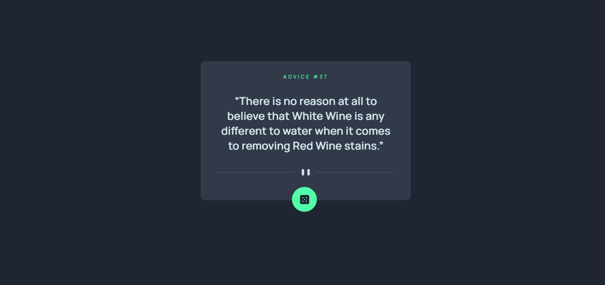
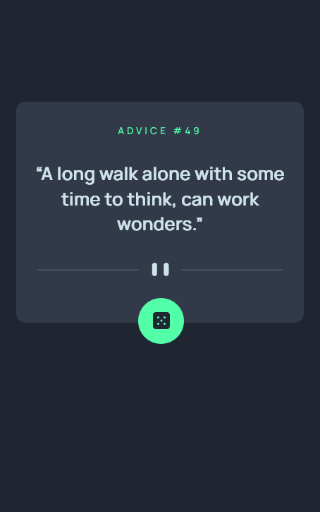

# Frontend Mentor - Advice generator app solution

This is a solution to the [Advice generator app challenge on Frontend Mentor](https://www.frontendmentor.io/challenges/advice-generator-app-QdUG-13db). Frontend Mentor challenges help you improve your coding skills by building realistic projects.

## Overview

### Screenshot

### Links

- Solution URL: [Github](https://github.com/iamenochlee/frontendmentor/tree/master/advice-generator-app)
- Live Site URL: [Github Pages](https://iamenochlee.github.io/frontendmentor/advice-generator-app/)

## My process

### Built with

- CSS custom properties
- CSS Flexbox
- Vanilla Javascript
- API
- JS Promises
  

### What I learned

In this exercise i interacted with an external API for Advice.

### Useful resources

- [APIs](https://www.taniarascia.com/how-to-connect-to-an-api-with-javascript/) - This article helped me in figuring out how to work with an API.

## Author

- enochlee

- Frontend Mentor - [@iamenochlee](https://www.frontendmentor.io/profile/iamenochlee)
- Twitter - [@iamenochlee](https://twitter.com/iamenochlee)
