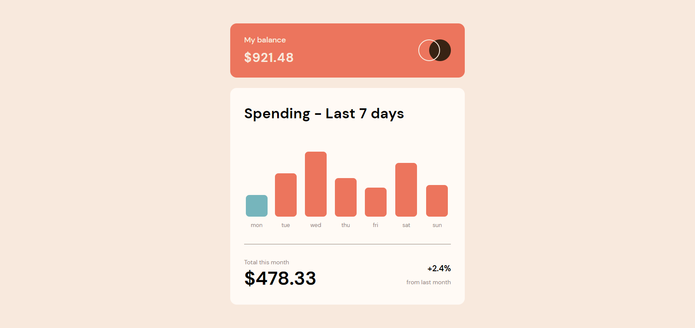
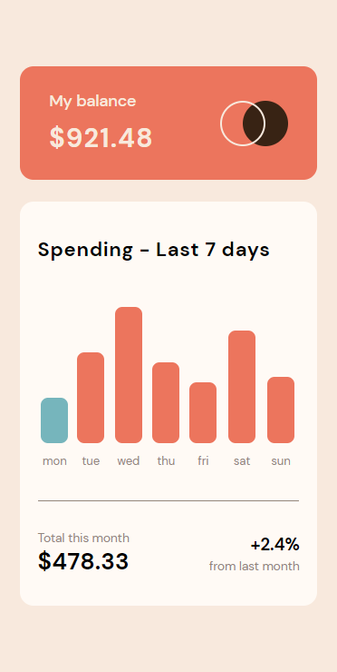

# Frontend Mentor - Expenses Chart app solution

This is a solution to the [Expenses Chart app challenge on Frontend Mentor](https://www.frontendmentor.io/challenges/expenses-chart-component-e7yJBUdjwt/hub/expenses-chart-vNLvNmK7fs). Frontend Mentor challenges help you improve your coding skills by building realistic projects.

## Overview

### Screenshot

### Links

- Solution URL: [Github](https://github.com/iamenochlee/frontendmentor/tree/master/expenses-chart)
- Live Site URL: [Vercel](https://expenses-chart-psi.vercel.app/)

## My process

I dynamically mapped through the Data using the price to determine the bar height, also present day gets a different styling

### Built with

- Semantic HTML
- React
- CSS custom properties
- CSS Flexbox

## Author

- enochlee

- Frontend Mentor - [@iamenochlee](https://www.frontendmentor.io/profile/iamenochlee)
- Twitter - [@iamenochlee](https://twitter.com/iamenochlee)
