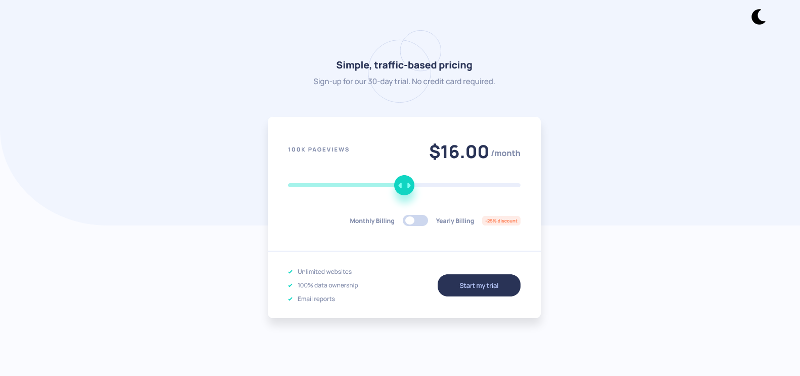

# Frontend Mentor - Interactive pricing component solution

This is a solution to the [Interactive pricing component challenge on Frontend Mentor](https://www.frontendmentor.io/challenges/interactive-pricing-component-t0m8PIyY8). Frontend Mentor challenges help you improve your coding skills by building realistic projects. 

## Overview

### Screenshot

### Links

- Solution URL: [Github](https://github.com/iamenochlee/frontendmentor/tree/master/interactive-pricing-component-main)
- Live Site URL: [Github Pages](https://iamenochlee.github.io/frontendmentor/interactive-pricing-component-main/)

## My process

### Built with

- Semantic HTML5 markup
- CSS custom properties
- Flexbox
- Vanilla Javascript
- Local Storage
  

### What I learned

In this exercise i put my javascript to test by implementing a price slider and discount bar. I added a dark-mode and default color scheme design to it.

### Useful resources

- [Using AJAX setInterval()](https://whitefoxcreative.com/developers/ajax/refresh-a-section-of-a-page-at-specific-intervals-using-ajax/) - This article helped me in figuring out how to automatically refreshing the price when the discount is checked.
- [LocalStorage for Darkmode](https://codepen.io/kevinpowell/pen/EMdjOV) - This code live demo which helped me in understanding LocalStorage

## Author

- enochlee

- Frontend Mentor - [@iamenochlee](https://www.frontendmentor.io/profile/iamenochlee)
- Twitter - [@iamenochlee](https://twitter.com/iamenochlee)

