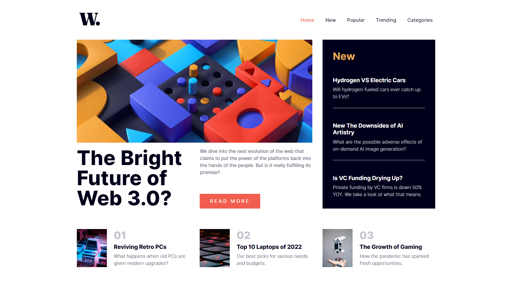

# Frontend Mentor - News homepage solution

This is a solution to the [News homepage challenge on Frontend Mentor](https://www.frontendmentor.io/challenges/news-homepage-H6SWTa1MFl). Frontend Mentor challenges help you improve your coding skills by building realistic projects.

## Table of contents

- [Frontend Mentor - News homepage solution](#frontend-mentor---news-homepage-solution)
  - [Table of contents](#table-of-contents)
  - [Overview](#overview)
    - [Screenshot](#screenshot)
    - [Links](#links)
    - [Built with](#built-with)
  - [Author](#author)

## Overview

Picked up this challenge in order to sharpen out my CSS Grid Skills, am glad it turned out well, and ofcourse it is responsive and as accessible, with a styled dark scheme for users who prefers darkmode.

### Screenshot

### Links

- Solution URL: [Github](https://github.com/iamenochlee/frontendmentor/tree/master/news-homepage-main)
- Live Site URL: [Live on Github Pages](https://iamenochlee.github.io/frontendmentor/news-homepage-main/)

### Built with

- Semantic HTML5 markup
- CSS Grid
- CSS custom properties
- Flexbox
-Javascript
- Mobile-first workflow
- CSS Animations
- CubeCSS components style approach

## Author

-EnochLee

- Frontend Mentor - [@iamenochlee](https://www.frontendmentor.io/profile/iamenochlee)
- Twitter - [@iamenochlee](https://www.twitter.com/iamenochlee)
