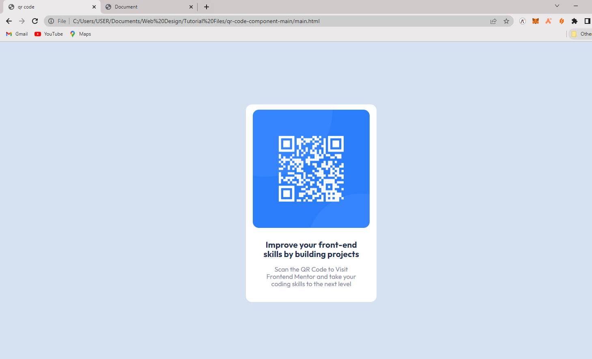

# Frontend Mentor - QR code component solution

This is a solution to the [QR code component challenge on Frontend Mentor](https://www.frontendmentor.io/challenges/qr-code-component-iux_sIO_H). Frontend Mentor challenges help you improve your coding skills by building realistic projects.

## Table of contents

- [Frontend Mentor - QR code component solution](#frontend-mentor---qr-code-component-solution)
  - [Table of contents](#table-of-contents)
  - [Overview](#overview)
    - [Screenshot](#screenshot)
    - [Links](#links)
  - [My process](#my-process)
    - [Built with](#built-with)
    - [What I learned](#what-i-learned)
    - [Continued development](#continued-development)
    - [Useful resources](#useful-resources)
  - [Author](#author)

## Overview

### Screenshot

### Links

- Solution URL: [Github](https://github.com/iamenochlee/frontendmentor/tree/master/qr-code-component-main)
- Live Site URL: [Github Pages](https://iamenochlee.github.io/frontendmentor/qr-code-component-main/)

## My process

### Built with

- Semantic HTML5 markup
- CSS custom properties
- CSS Grid

### What I learned

During this exercise i learned how important it is to properly structure websites/ webpages in needed and only necessary html tags, guring this process i placed all my contents in a div tag, which were not needed, they only crowded my code, and gave me extra work, i had to start afresh, so lets keep our pages well structed.

### Continued development

I am currently focusing on learning react, and will proceed with other frontend developer exercises.

### Useful resources

- [Centering Divs](https://blog.hubspot.com/website/center-div-css#:~:text=You%20can%20do%20this%20by,the%20div) - This was helpful in centering the boxes in this exercise, highly recommended.
- [Working with Images](https://www.w3schools.com/css/css3_images.asp) - This is an amazing article which helped me finally understand images. I'd recommend it to anyone still learning this concept.

## Author

- Frontend Mentor - [@iamenochlee](https://www.frontendmentor.io/profile/iamenochlee)
- Twitter - [@iamenochlee](https://twitter.com/iamenochlee)
