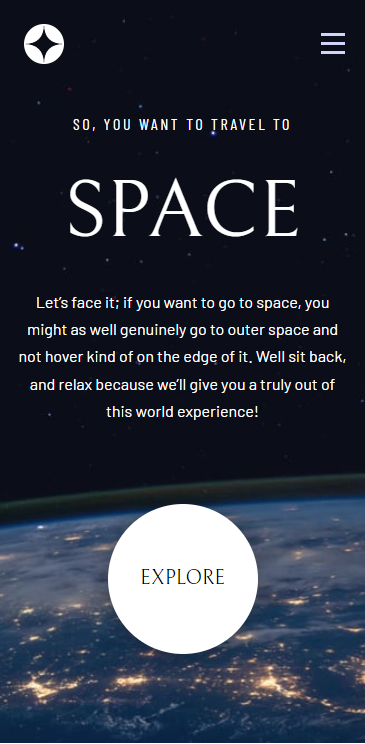
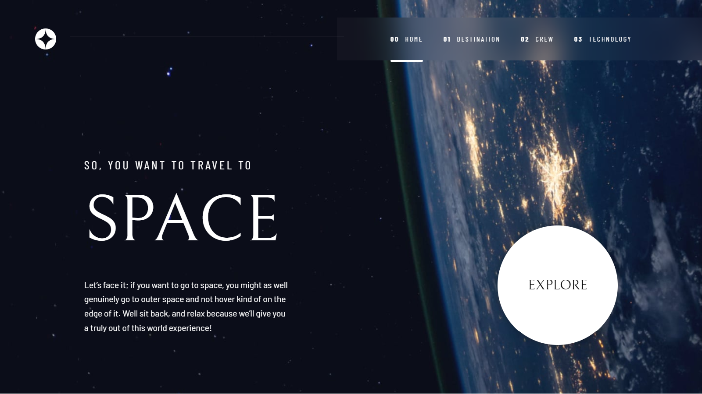

## - Space Tourism Website Repository

This is a solution to the [Space Tourism Website](https://www.frontendmentor.io/challenges/space-tourism-multipage-website-gRWj1URZ3). Frontend Mentor challenges help you improve your coding skills by building realistic projects.

### Screenshot

#### Mobile

#### Desktop

### Links

- Solution URL: [Github](https://github.com/iamenochlee/frontendmentor/tree/master/space-tour-website)
- Live Site URL: [Vercel](https://space-tour-website.vercel.app/)

## My process

### Built with

- Next Js
- React Hooks
- Mobile First Workflow
- Semantic HTML5 markup
- CSS custom variables
- CSS Grid and Flexbox
- CSS Modules
- Framer Motion(Animations)
- React Responsive Library

## Author

- enochlee

- Frontend Mentor - [@iamenochlee](https://www.frontendmentor.io/profile/iamenochlee)
- Twitter - [@iamenochlee](https://twitter.com/iamenochlee)
